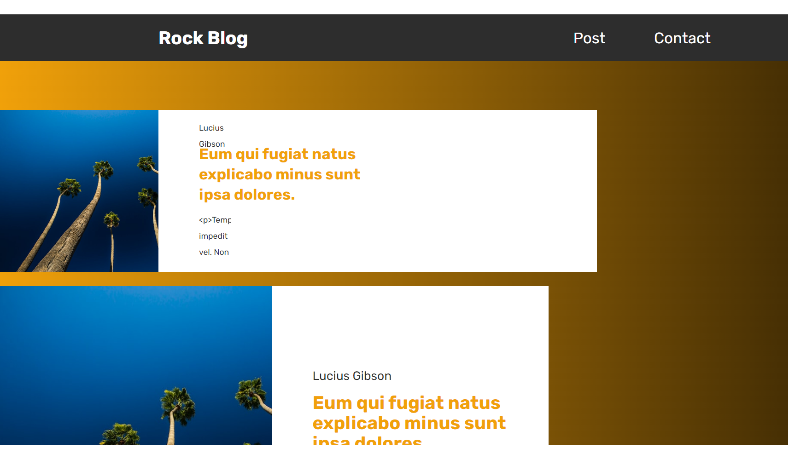
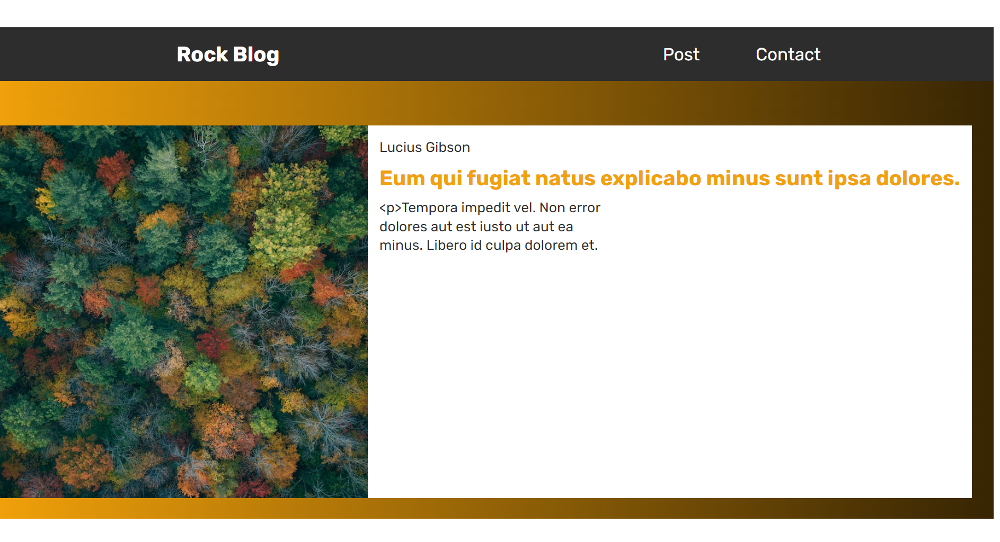
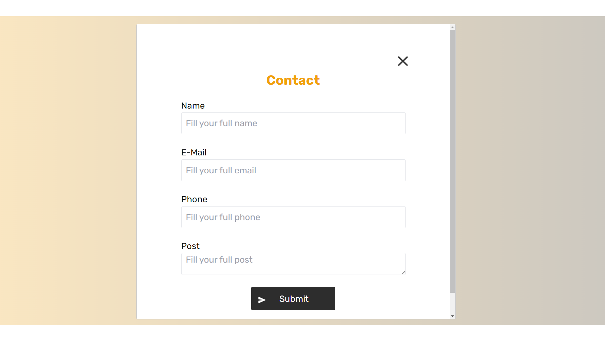

## :bookmark: Sobre

Este repositório é o resultado para o **teste de frontEnd** da Coderockr

## Tecnologias Utilizadas

Esse projeto foi desenvolvido com as seguintes tecnologias:

- [React](https://reactjs.org/)
  - Framework para desenvolver interfaces com JavaScript.
- [React-router-dom](https://reactrouter.com/en/main)
  - O **React-router-dom** serve para fazer o roteamento e navegação.
- [Eslint](https://eslint.org/)
  - O eslint é uma biblioteca que ajuda na padronização do codigo.
- [Prettier](https://prettier.io/)
  - O prettier é uma biblioteca que ajuda na padronização do codigo, assim como o eslint.
- [Tailwindcss](https://tailwindcss.com/)
  - O Tailwindcss é uma biblioteca para estilos no ReactJS usando CSS-in-JS.
  - No projeto, foi utilizado para facilitar na criação de estilos.
- [Axios](https://github.com/axios/axios)
  - O axios é uma lib para conexões HTTP.
  - No projeto, eu utilizei ele para trazer as informações da API.

## 🎨 Layout

<h1 align="center">
  
  
  
</h1>

## :zap: Como usar

1. Faça um clone desse repositório: `git clone https://github.com/leonardoCavachini/blogRock.git`
2. Instale as dependências: `npm install` ou `yarn`
3. Inicie a aplicação: `npm run dev` ou `yarn run dev`

## Ver aplicação
- [web](https://leonardocavachini.github.io/blogRock/)
